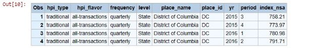
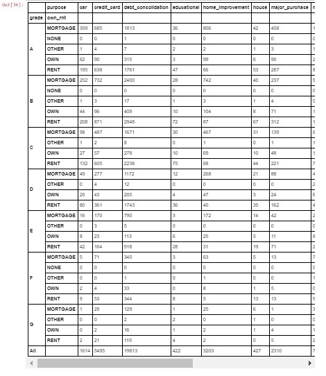

# Lab : Additional Data Handling 

#### Pre-reqs:
- Google Chrome (Recommended)

#### Lab Environment
Notebooks are ready to run. All packages have been installed. There is no requirement for any setup.

**Note:** Elev8ed Notebooks (powered by Jupyter) will be accessible at the port given to you by your instructor. Password for jupyterLab : `1234`

All Notebooks are present in `work/PythonForSASUsers` folder. To copy and paste: use **Control-C** and to paste inside of a terminal, use **Control-V**

You can access jupyter lab at `<host-ip>:<port>/lab/workspaces/lab13_DataHandling`

##### Run Notebook
Click notebook `Chapter 12 -- Additional Data Handling .ipynb` in jupterLab UI and run jupyter notebook.

## Topics Covered:

Sort and Sort Sequences

Drop/Keep Columns

Rename Columns

Find Duplicate Values

Extract Duplicate Rows to a new DataFrame

Drop Duplicate Rows

Add a New DataFrame Column

Cast Strings to Float

Concatenating DataFrames (Join)

Crosstabs

Sampling

Binning Continuous Values

Save to Disk

Resources


```
In [1]:
import numpy as np
import pandas as pd
from pandas import Series, DataFrame, Index
from IPython.display import Image

## Sort and Sort Sequences

The example below is used in Time Series Walk-Through in Chapter 09 -- Panda Time Series and Date Handling. It uses the read_csv() method to construct the 'df_us' DataFrame begining its read on row 3,082.


```
In [2]:
df_states = pd.read_csv("C:\Data\\HPI_master.csv",                 
            skiprows=3082,
            usecols=(0, 1, 2, 3, 4, 5, 6, 7, 8),
            names=('hpi_type', 'hpi_flavor', 'frequency', 'level', 'place_name', 'place_id', 'yr', 'period', 'index_nsa'),
            header=None)
The following SAS Data Step reads the same .csv file using FIRSTOBS= to begin reading from an arbitary row position.

    /********************************/
    /* c09_read()_csv_df_states.sas */
    /********************************/
    data df_states;
          infile 'C:\Data\HPI_master.csv' delimiter=',' missover dsd firstobs=3081; 
          informat hpi_type $12.
                   hpi_flavor $16.
                   frequency $9.
                   level $28.
                   place_name $33.
                   place_id $8.
                   yr $5.
                   period $6.
                   index_nsa 8.;
             input hpi_type $
                   hpi_flavor $
                   frequency $
                   level $
                   place_name $
                   place_id $
                   yr $
                   period $
                   index_nsa ;
Verify the read using the .shape attribute.


```
In [3]:
df_states.shape
```

Out3]:
(96244, 9)
Inspect the first 5 rows of the 'df_states' DataFrame.


```
In [4]:
df_states.head()


Inspect the first 5 rows of the SAS data set df_states.


```
In [5]:
Image(filename='output/df_states_output.JPG')


Exam the default sort by supplying the the sort key as the minimum argument to the .sort_values() attribute. The sort operation creates the new 'default_srt' DataFrame.


```
In [6]:
default_srt = df_states.sort_values('index_nsa')
Display the first 4 rows of the sorted DataFrame 'default_srt'


```
In [7]:
default_srt.iloc[0:4]


By examing the first the first four rows of the sorted DataFrame, 'default_srt' we see the default sort sequence is ascending. Of course, by reading the doc for pandas.DataFrame.sort_values we could 'see' this as well.

The default SAS sort syntax is:

    /******************************************************/
    /* c12_print_first4_rows_sorted.sas                   */
    /******************************************************/
84  proc sort data=df_states;
85      by index_nsa;
NOTE: 96244 observations were read from "WORK.df_states"
NOTE: Data set "WORK.df_states" has 96244 observation(s) and 9 variable(s)
86         
87   proc print data=df_states (obs=4);
Like panda the default SAS sort sequence is ascending. This is confirmed by the SAS doc located here .


```
In [8]:
Image(filename='output/default_first_four.JPG')


In contrast to the panda default sort the default SAS sort sequence places its missing values first in the data set as illustrated above.

Displaying the last 4 rows in the 'default_srt' DataFrame finds the 2 NaN's sorted last since this is the default location panda places its missing values.


```
In [9]:
default_srt.tail(4)


panda's default sort sequence places NaN's last in the sort sequence by default and can be used as an alternative to boolean operators and the .loc() method to detect missing values.

The SAS program to access the last four observations in the data set is:

    /******************************************************/
    /* c12_print_last4_rows_sorted.sas                    */
    /******************************************************/
    79         data last4;  
    80           set df_states (firstobs=96241);
    81           by index_nsa;

    NOTE: 4 observations were read from "WORK.last4"


```
In [10]:
Image(filename='output/sort_last_four.JPG')



Alter the organization of the 'states_desc' DataFrame by supplying arguments and values to the sort_values() attribute. The example below sorts descending placeing missing values at the beginning of the DataFrame.


```
In [11]:
states_desc = df_states.sort_values('index_nsa', ascending=False, na_position='first')
Setting the na_position= argument to 'first' places NaN's at the beginning of the sort sequence. This is the same beavhior for SAS' sort sequence. Details describing SAS sort order for missing values is descried here .

The first two rows in the DataFrame 'states_desc' contain the NaN's values for the 'index_nsa' column, while the next 2 rows contain the highest values.


```
In [12]:
states_desc.iloc[0:4,]


SAS has missing 28 missing value indicators for numerics described here . However, if you want missing values to be 'first' in a data set using an ascending sort sequence, then the missing value indicator must be an actual numeric value larger than the largest non-missing value. In other words, by default, the SAS missing value indicator for numerics is always the smallest numeric value.

The SAS example below sorts the df_states data set in descending order by the 'index_nsa' variable. Like the panda example above, the

out=states_srt2

syntax creates the new SAS data set 'states_srt2'.

    /******************************************************/
    /* c12_print_last4_rows_sorted_descending.sas        */
    /*****************************************************/
    44        proc sort data=df_states
    45           out=states_srt2;
    46           by descending index_nsa;
    NOTE: 96244 observations were read from "WORK.df_states"
    NOTE: Data set "WORK.states_srt2" has 96244 observation(s) and 9 variable(s)
    47        
    48         data first4;
    49           set states_srt2 (obs=4);
    50           by descending index_nsa;

```
In [13]:
Image(filename='output/sort_last4_descending.JPG')


The section below examines a number of common data management patterns for analysis.

1. Read the Lending Club Loan Status file.

```
In [14]:
lc = pd.read_csv("data/LC_Loan_Stats.csv",
                 low_memory=False)     
lc.shape
```

Out14]:
(42633, 51)
Check for missing values. Clearly, some columns are not useful.


```
In [15]:
lc.isnull().sum()
```

Out15]:
ID                                 2
Member_ID                          3
Loan_Amnt                          3
Term                               3
Int_Rate                           3
Installment                        3
Grade                              3
Sub_Grade                          3
Emp_Length                         3
Home_Ownership                     3
Annual_Inc                         7
Verification_Status                3
Loan_Status                        3
Purpose                            3
Zip_Code                           3
Addr_State                         3
DTI                                3
Delinq_2yrs                       32
Earliest_Cr_Line                  32
Inq_Last_6mths                    32
Mths_Since_Last_Delinq         26998
Mths_Since_Last_Record         38978
Open_Acc                          32
Pub_Rec                           32
Revol_Bal                          3
Revol_Util                        93
Total_Acc                         32
Initial_List_Status                3
Out_Prncp                          3
Out_Prncp_Inv                      3
Total_Pymnt                        3
Total_Pymnt_Inv                    3
Total_Rec_Prncp                    3
Total_Rec_Int                      3
Total_Rec_Late_Fee                 3
Recoveries                         3
Collection_Recovery_Fee            3
Last_Pymnt_D                      85
Last_Pymnt_Amnt                    3
Next_Pymnt_D                   39412
Last_Credit_Pull_D                 7
Collections_12_Mths_Ex_Med       148
Mths_Since_Last_Major_Derog    42633
Policy_Code                        3
Application_Type                   3
Annual_Inc_Joint               42633
Acc_Now_Delinq                    32
Chargeoff_Within_12_Mths         148
Delinq_Amnt                       32
Pub_Rec_Bankruptcies            1368
Tax_Liens                        108
dtype: int64

## Drop/Keep Columns

Keep some of the columns in the 'lc' DataFrame.


```
In [16]:
lc = lc[['ID', 'Member_ID', 'Loan_Amnt', 'Term', 'Int_Rate', 'Installment', 'Grade', 'Sub_Grade', 'Emp_Length',
                     'Home_Ownership', 'Annual_Inc', 'Verification_Status', 'Loan_Status', 'Purpose', 'Zip_Code',
                     'Addr_State', 'DTI', 'Delinq_2yrs', 'Earliest_Cr_Line', 'Inq_Last_6mths', 'Open_Acc', 'Revol_Bal',                          
                     'Revol_Util']]

## Rename Columns


```
In [17]:
lc = lc.rename(columns = {
           'Member_ID'              :'mem_id',
           'Loan_Amtn'              :'ln_amt',
           'Int_Rate'               :'rate',
           'Home_Ownership'         :'own_rnt',
           'Verification_Status'    :'vrfy_stat',
           'Loan_Status'            :'ln_stat',
           'Addr_State'             :'state',
           'Earliest_Cr_Line'       :'earliest_ln'
    })
Lower-case all the 'lc' DataFrame column names.


```
In [18]:
lc.columns = map(str.lower, lc.columns)
An investigation of the LC_Loan_Stats.csv file reveals it has 2 parts. The first part, rows 0 to 39786 contain data for those loans meeting their credit policies. Rows 39790 to the end contain data for those loans that are outside their normal lending policies.

Create the 'lc1' DataFrame by reading a sub-set of columns and rows.


```
In [19]:
lc1 = pd.read_csv("data/LC_Loan_Stats.csv", 
          low_memory=False,            
          usecols=(0, 1, 2, 3, 4, 5, 6, 7, 8, 9, 10, 12, 13, 15, 16, 17, 18, 19, 22, 24, 25),
          names=('id','mem_id', 'ln_amt', 'term','rate', 'm_pay', 'grade', 'sub_grd', 'emp_len',
                 'own_rnt', 'income', 'ln_stat', 'purpose', 'state', 'dti', 'delinq_2yrs', 'ln_fst',
                'inq_6mnth', 'open_acc', 'revol_bal', 'revol_util' ),
          skiprows=1,
          nrows=39786,
          header=None)
lc1.shape
```

Out19]:
(39786, 21)
The analog SAS program for reading sub-sets of rows and columns from the 'LC_Loan_Stats.csv' file.

    /******************************************************/
    /* c12_read_1st_half_loan_cvs.sas                     */
    /******************************************************/
    4         options obs=39787;
    5         proc import datafile="c:\data\LC_Loan_Stats.csv"
    6              dbms=csv
    7              out=loans
    8              replace;
    9
    10          data lc1(rename=(Member_ID     = mem_id
    12                        Loan_Amnt        = ln_amt
    13                        Int_Rate         = rate
    14                        Installment      = m_pay
    15                        Sub_Grade        = sub_grd
    16                        Emp_Length       = emp_len
    17                        Home_Ownership   = own_rnt
    18                        Annual_Inc       = income
    19                        Loan_Status      = ln_stat
    20                        Addr_State       = state
    21                        Earliest_Cr_Line = ln_fst
    22                        Inq_Last_6mths   = inq_6mnth));
    23       
    24         set loans(keep =  ID
    25                           Member_ID
    26                           Loan_Amnt
    27                           Term
    28                           Int_Rate
    29                           Installment
    30                           Grade
    31                           Sub_Grade
    32                           Emp_Length
    33                           Home_Ownership
    34                           Annual_Inc
    35                           Loan_Status
    36                           Purpose
    37                           Addr_State
    38                           DTI
    39                           Delinq_2yrs
    40                           Earliest_Cr_Line
    41                           Inq_Last_6mths
    42                           Open_Acc
    43                           Revol_Bal
    44                           Revol_Util);
    45
    46        ln_plcy = 'True';

    NOTE: 39786 observations were read from "WORK.loans"
    NOTE: Data set "WORK.lc1" has 39786 observation(s) and 22 variable(s)

## Find Duplicate Values

In the 'lc1' DataFrame we expect to find no duplicate id values. Setting the .duplicated attribute to False returns all of the duplicate values, in our case for the lc1['id'] column. The .duplicated() attribute for DataFrames is documented here.

False marks all duplicate values as True. Create the new 'lc1_dups' DataFrame containing the duplicates for the lc1['id'] column. If its length is zero then there are no duplicates. Locating the duplicate rows is not the same as removing then which is illustrated below.

Begin by setting the index to the lc1['id'] column. Next, create a Boolean mask locating the duplicate values for the lc1['id'] column. The keep='first' argument behaves similiar to SAS FIRST.variable in BY-Group processing. We want to ignore the first occurance of the duplicate 'index' column value and extract the remaining ones.


```
In [20]:
lc1.set_index('id', inplace=True, drop=False)
dup_mask = lc1.duplicated('id', keep='first')

## Extract Duplicate Values

Apply the Boolean mask using the .loc attribute to create the new 'lc1_dups' DataFrame. The .shape attribute shows there are 35 rows with duplicate 'id' values.


```
In [21]:
lc1_dups = lc1.loc[dup_mask]
lc1_dups.shape
```

Out21]:
(35, 21)
The SAS SORT option NODUPKEY checks for and eliminates observations with duplicate BY values. The DUPOUT= option names the target SAS data set to write the duplicates.

    /******************************************************/
    /* c12_sort_nodupkey.sas                              */
    /******************************************************/
    50       proc sort data = lc1 dupout=lc1_dups nodupkey;
    51          by id;
    NOTE: 39786 observations were read from "WORK.lc1"
    NOTE: 35 observations were found and deleted due to having duplicate sort keys
    NOTE: Data set "WORK.lc1" has 39751 observation(s) and 21 variable(s)
    NOTE: Data set "WORK.lc1_dups" has 35 observation(s) and 21 variable(s)

## Drop Duplicate Rows


```
In [22]:
lc1.shape
```

Out22]:
(39786, 21)
Use the .drop_duplicates attribute to drop duplicate values.


```
In [23]:
lc1.drop_duplicates(['id'], keep='first', inplace=True)

```
In [24]:
lc1.shape
```

Out24]:
(39751, 21)

## Add a New DataFrame Column

Create the new column lc1['ln_plcy'] as a flag to indicate all rows read from row 2 to 39786 are loans granted within standard lending guidelines.


```
In [25]:
lc1['ln_plcy'] = lc1['id'].map(lambda x: True)
lc1.shape
```

Out25]:
(39751, 22)

## Cast Strings to Floats


```
In [26]:
lc1.describe(include=['O'])


Both the lc1['rate'] and lc1['revol_util'] column values are formatted with Excel's percent format (%), making them string values. The .replace() method replaces the '%' with a white-space. The .astype attribute converts the string into a float. The resulting float is divided by 100.


```
In [27]:
lc1['revol_util'] = lc1.revol_util.replace('%','',regex=True).astype('float')/100
lc1['rate'] = lc1.rate.replace('%','',regex=True).astype('float')/100
With the lc1['revol_util'] column values cast to floats use the .fillna() attribute to replace missing values with the calculated mean value from the lc1['revol_util'] column.


```
In [28]:
lc1["revol_util"] = lc1[["revol_util"]].fillna(lc1.revol_util.mean())
lc1.revol_util.isnull().sum()
```

Out28]:
0
The analog SAS program uses PROC SQL to insert the mean value for 'revol_util' into the SAS Macro variable 'mean_revol'. A WHERE statement is used to locate the NULL values for the variable 'revol_util' and if found then the UPDATE statement inserts the value from the SAS MACRO variable &mean_revol into the 'revol_util' column.

The CREATE TABLE statement starting at line 13 tests if there are missing values found for the column 'revol_util'.

    /******************************************************/
    /* c12_update_missing_revol_until.sas                 */
    /******************************************************/
    6       proc sql;
    7          select mean(revol_util) format 6.2 into :mean_revol
    8          from lc1;
    9       update lc1
    10            set revol_util = &mean_revol
    11            where revol_util is null;
    NOTE: 50 record(s) updated in table WORK.lc1
    12       
    13       create table miss as
    14          select revol_util
    15          from lc1
    16          where revol_util is null;
    NOTE: Data set "WORK.miss" has 0 observation(s) and 1 variable(s)
    17       quit;

## 2. Read the second portion of the LC_Loan_Stats.csv file beginning with row 39790.##

Create the 'lc0' DataFrame by reading the loan status file, supplying a tuple of integers for the usecols= argument and a tuple of names for the column labels.


```
In [29]:
lc0 = pd.read_csv("data/LC_Loan_Stats.csv", 
          low_memory=False,            
          usecols=(0, 1, 2, 3, 4, 5, 6, 7, 8, 9, 10, 12, 13, 15, 16, 17, 18, 19, 22, 24, 25),
          names=('id','mem_id', 'ln_amt', 'term','rate', 'm_pay', 'grade', 'sub_grd', 'emp_len',
                 'own_rnt', 'income', 'ln_stat', 'purpose', 'state', 'dti', 'delinq_2yrs', 'ln_fst',
                'inq_6mnth', 'open_acc', 'revol_bal', 'revol_util' ),
          skiprows=39790,
          header=None)
lc0.shape
```

Out29]:
(2844, 21)
Create the column lc0['ln_plcy'] with a value of False to indicate rows 39790 to the end of the file are loans made outside the standard credit lending policy. The assignment below uses the .map() attribute and calls the anonymous lambda function to create the new column lc0[''ln_plcy'].


```
In [30]:
lc0['ln_plcy'] = lc0['id'].map(lambda x: False)
Similiar to above, the lc0['rate'] and lc0['revol_util'] column values are formatted with Excel's percent format (%), making them string values. The .replace() method replaces the '%' with a white-space. The .astype() attribute converts the string into a float. The resulting float is divided by 100.


```
In [31]:
lc0['revol_util'] = lc0.revol_util.replace('%','',regex=True).astype('float')/100
lc0['rate'] = lc0.rate.replace('%','',regex=True).astype('float')/100
Calculate the mean value for 'revol_util' and use the .fillna method to replace the missing values.


```
In [32]:
lc0['revol_util'] = lc0[["revol_util"]].fillna(lc0.revol_util.mean())
Return the number of missing values.

lc0.revol_util.isnull().sum()

## Concatenating DataFrames (Join)

Chapter 7 -- Pandas, Part 2 covers joining operations by illustrating the pd.merge() method which follows SQL's relational algebraic statements. An alternative is the concat function described here.


```
In [33]:
print(lc0.shape)
print(lc1.shape)
(2844, 22)
(39751, 22)
Use the pd.concat() method to join the 'lc1' and 'lc0' DataFrames.


```
In [34]:
frames = [lc1, lc0]
df = pd.concat(frames)
df.shape
```

Out34]:
(42595, 22)
The analog SAS program uses the SET statement to join the data sets 'lc0' and 'lc1' together. The variable names are identical in both data sets.

    /******************************************************/
    /* c12_concatenate_lc0_lc1.sas                        */
    /******************************************************/
    7       data df;
    8          set lc0
    9              lc1;
    10       run;

    NOTE: 2844 observations were read from "WORK.lc0"
    NOTE: 39751 observations were read from "WORK.lc1"
    NOTE: Data set "WORK.df" has 42595 observation(s) and 22 variable(s)

## Crosstabs


```
In [35]:
pd.crosstab(df.grade, df.own_rnt , margins=True)


```
In [36]:
pd.crosstab([df.grade, df.own_rnt], df.purpose, margins=True)



## Sampling


```
In [37]:
samp = df.sample(n=300)

```
In [38]:
import bokeh.charts
import bokeh.charts.utils
import bokeh.io
import bokeh.models
import bokeh.palettes
import bokeh.plotting
from bokeh.charts import Bar, Scatter, BoxPlot, Histogram
bokeh.io.output_notebook()
Loading BokehJS ...

```
In [39]:
p = BoxPlot(samp, values='income', label='grade', color='firebrick',
                      title="Average Interest Rate by Credit Grade")

bokeh.io.show(p)

## Binning Continuous Values

Locate the minimum and maximum values. Scalars are returned. Returning a row using a minimum value is illustrated here and for maximum value here.


```
In [40]:
print(df.dti.min())
print(df.dti.max())
0.0
29.99
Create the list 'bins' containing integer values used to define bin levels. Construct the list 'names' to define the labels for the bins.


```
In [41]:
bins = [0, 5, 10, 15, 20, 25, 30]
names=['0-5%', '5-10%', '10-15%', '15-20%', '20-25%', '25-30%']
df['dti_cat'] = pd.cut(df['dti'], bins, labels=names, include_lowest=True)
Call pd.value_counts() method to return a count of values for each bin level.


```
In [42]:
pd.value_counts(df['dti_cat'])
```

Out42]:
10-15%    10502
15-20%     9775
5-10%      8563
20-25%     7376
0-5%       5552
25-30%      827
Name: dti_cat, dtype: int64
Return the count of missing values for the df['income'] column.


```
In [43]:
df['income'].isnull().sum()
```

Out43]:
4
Call the .fillna() method to replace missing values for the df['income'] column with the calcuated column mean. Additional examples for detecting and replacing missing values are described here.


```
In [44]:
df['income'] = df[["income"]].fillna(df.income.mean())

```
In [45]:
print(df.income.max())
print(df.income.min())
6000000.0
1896.0
Call the pd.qcut() method for creating deciles for the df['income'] column and copy them into the new df['inc_cat'] column. A more detailed example of creating deciles is described in the section Understanding Binning in Chapter 10--GroupBy.


```
In [46]:
df['inc_cat'] = pd.qcut(df['income'].values, 10).codes
Return the count of values from the income decile values in the df['inc_cat'] column.


```
In [47]:
pd.value_counts(df['inc_cat'])
```

Out47]:
0    5088
7    4436
4    4309
3    4306
2    4265
9    4260
6    4253
5    4163
8    4082
1    3433
Name: inc_cat, dtype: int64
The df['inc_cat'] column containing income deciles used as the rows and values for df['grade'] nested inside values from the df['ln_plcy'] column as the header in a Crosstab.


```
In [48]:
pd.crosstab(df.inc_cat, [df.ln_plcy, df.grade] , margins=True)


## Save to Disk

The .to_pickle() method serializes the 'df' DataFrame in order to write to disk. The .to_pickle() method is documented here. The DataFrame is read in Chapter 10-- GroupBy.


```
In [49]:
df.to_pickle('lending_club.pkl')
We can also write the 'lc0' and 'lc1' DataFrames out as a .csv files.


```
In [50]:
lc0.to_csv("C:\Data\\Loans_lc0.csv")
lc1.to_csv("C:\Data\\Loans_lc1.csv")

## Resources

Delete Duplicates in Pandas, by Chris Albon located here.

pandas.cut API doc located here.