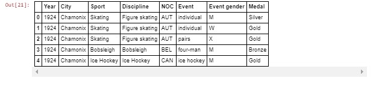

# Lab : Data Interchange not working with SAS

#### Pre-reqs:
- Google Chrome (Recommended)

#### Lab Environment
Notebooks are ready to run. All packages have been installed. There is no requirement for any setup.

**Note:** Elev8ed Notebooks (powered by Jupyter) will be accessible at the port given to you by your instructor. Password for jupyterLab : `1234`

All Notebooks are present in `work/PythonForSASUsers` folder. To copy and paste: use **Control-C** and to paste inside of a terminal, use **Control-V**

You can access jupyter lab at `<host-ip>:<port>/lab/workspaces/lab14_Interchange`

##### Run Notebook
Click notebook `Data_Interchange_not_working_with_sas.df2sd.ipynb` in jupterLab UI and run jupyter notebook.

## Data Interchange Examples


```
In [1]:
import feather
import pandas as pd
import saspy
pd.show_versions()
INSTALLED VERSIONS
------------------
commit: None
python: 3.6.3.final.0
python-bits: 64
OS: Linux
OS-release: 3.10.0-693.11.1.el7.x86_64
machine: x86_64
processor: x86_64
byteorder: little
LC_ALL: None
LANG: en_US.UTF-8
LOCALE: en_US.UTF-8

pandas: 0.20.3
pytest: 3.2.1
pip: 9.0.1
setuptools: 38.2.4
Cython: 0.26.1
numpy: 1.13.3
scipy: 0.19.1
xarray: None
IPython: 6.2.1
sphinx: 1.6.3
patsy: 0.4.1
dateutil: 2.6.1
pytz: 2017.2
blosc: None
bottleneck: 1.2.1
tables: 3.4.2
numexpr: 2.6.2
feather: 0.4.0
matplotlib: 2.1.0
openpyxl: 2.4.8
xlrd: 1.1.0
xlwt: 1.3.0
xlsxwriter: 1.0.2
lxml: 4.1.0
bs4: 4.6.0
html5lib: 0.999999999
sqlalchemy: 1.1.13
pymysql: None
psycopg2: None
jinja2: 2.9.6
s3fs: None
pandas_gbq: None
pandas_datareader: None

```
In [2]:
sas = saspy.SASsession()
Using SAS Config named: default
SAS Connection established. Subprocess id is 4942

Example from: https://github.com/sassoftware/saspy/blob/master/saspy_example_github.ipynb


```
In [3]:
cars = sas.sasdata('cars', libref='sashelp')

```
In [4]:
print(type(cars))
<class 'saspy.sasbase.SASdata'>
SAS dataset SASHELP.CARS converted to panda dataframe car_df


```
In [5]:
car_df = cars.to_df()

```
In [6]:
print(type(car_df))
<class 'pandas.core.frame.DataFrame'>
panda dataframe car_df converted to SAS dataset WORK.CARS


```
In [7]:
car_df2 = sas.df2sd(car_df, 'cars')

```
In [8]:
print(type(car_df2))
<class 'saspy.sasbase.SASdata'>
Read a dataframe from disk with the feather library created previously from a R dataframe


```
In [9]:
path = '/home/sas/notebook/r_staff.feather'
pd_staff = feather.read_dataframe(path)

```
In [10]:
pd_staff.dtypes
```

Out10]:
employee                  category
salary                     float64
startdate           datetime64[ns]
stringsASFactors              bool
dtype: object

```
In [11]:
print(type(pd_staff))
<class 'pandas.core.frame.DataFrame'>

```
In [12]:
print(pd_staff)
             employee   salary  startdate  stringsASFactors
0      Thomas Gunther  27500.0 2010-11-01             False
1  Nicholas Harbinger  33900.0 2008-03-25             False
2       Gisela Benito  28000.0 2007-03-14             False
3    Herbert Rudelich  35000.0 2011-01-24             False
4     Emily Sirignano  36350.0 2009-12-15             False
5    Michael Morrison  40000.0 2009-10-10             False
6   Jacqueline Onieda  36500.0 2015-01-02             False
The dataframe pd_staff appears acceptable to Python, but is not acceptable to the sas.df2sd call


```
In [13]:
sd_staff = sas.df2sd(pd_staff, 'staff')
---------------------------------------------------------------------------
NotImplementedError                       Traceback (most recent call last)
<ipython-input-13-7607062bf09b> in <module>()
----> 1 sd_staff = sas.df2sd(pd_staff, 'staff')

/root/anaconda3/lib/python3.6/site-packages/saspy/sasbase.py in df2sd(self, df, table, libref, results)
    618         :return: SASdata object
    619         """
--> 620         return self.dataframe2sasdata(df, table, libref, results)
    621 
    622     def dataframe2sasdata(self, df: 'pd.DataFrame', table: str = '_df', libref: str = '',

/root/anaconda3/lib/python3.6/site-packages/saspy/sasbase.py in dataframe2sasdata(self, df, table, libref, results)
    637             return None
    638         else:
--> 639             self._io.dataframe2sasdata(df, table, libref)
    640 
    641         if self.exist(table, libref):

/root/anaconda3/lib/python3.6/site-packages/saspy/sasiostdio.py in dataframe2sasdata(self, df, table, libref)
    894          input += "'"+df.columns[name]+"'n "
    895          if df.dtypes[df.columns[name]].kind in ('O','S','U','V'):
--> 896             col_l = df[df.columns[name]].map(len, 'ignore').max()
    897             if col_l == 0:
    898                col_l = 8

/root/anaconda3/lib/python3.6/site-packages/pandas/core/series.py in map(self, arg, na_action)
   2127             values = self._values
   2128             if na_action is not None:
-> 2129                 raise NotImplementedError
   2130             map_f = lambda values, f: values.map(f)
   2131         else:

NotImplementedError: 
Copy the pd_staff dataframe with default deep=True


```
In [14]:
copy_deep_true = pd_staff.copy()
id(pd_staff)
```

Out14]:
140465635419640

```
In [15]:
print(type(copy_deep_true))
id(copy_deep_true)
<class 'pandas.core.frame.DataFrame'>
```

Out15]:
140464967919432
Call the sas.df2sd method. The copied dataframe is not acceptable to this call.


```
In [16]:
cdt = sas.df2sd(copy_deep_true, 'staff_t')
---------------------------------------------------------------------------
NotImplementedError                       Traceback (most recent call last)
<ipython-input-16-9d457eae85df> in <module>()
----> 1 cdt = sas.df2sd(copy_deep_true, 'staff_t')

/root/anaconda3/lib/python3.6/site-packages/saspy/sasbase.py in df2sd(self, df, table, libref, results)
    618         :return: SASdata object
    619         """
--> 620         return self.dataframe2sasdata(df, table, libref, results)
    621 
    622     def dataframe2sasdata(self, df: 'pd.DataFrame', table: str = '_df', libref: str = '',

/root/anaconda3/lib/python3.6/site-packages/saspy/sasbase.py in dataframe2sasdata(self, df, table, libref, results)
    637             return None
    638         else:
--> 639             self._io.dataframe2sasdata(df, table, libref)
    640 
    641         if self.exist(table, libref):

/root/anaconda3/lib/python3.6/site-packages/saspy/sasiostdio.py in dataframe2sasdata(self, df, table, libref)
    894          input += "'"+df.columns[name]+"'n "
    895          if df.dtypes[df.columns[name]].kind in ('O','S','U','V'):
--> 896             col_l = df[df.columns[name]].map(len, 'ignore').max()
    897             if col_l == 0:
    898                col_l = 8

/root/anaconda3/lib/python3.6/site-packages/pandas/core/series.py in map(self, arg, na_action)
   2127             values = self._values
   2128             if na_action is not None:
-> 2129                 raise NotImplementedError
   2130             map_f = lambda values, f: values.map(f)
   2131         else:

NotImplementedError: 
Copy pd_staff operation with deep=false parameter


```
In [17]:
copy_deep_false = pd_staff.copy(deep=False)
id(pd_staff)
```

Out17]:
140465635419640

```
In [18]:
print(type(copy_deep_false))
id(copy_deep_false)
<class 'pandas.core.frame.DataFrame'>
```

Out18]:
140464967921000
Call the sas.df2sd method. copy_deep_false dataframe is not acceptable.


```
In [19]:
cdf = sas.df2sd(copy_deep_false, 'staff_f')
---------------------------------------------------------------------------
NotImplementedError                       Traceback (most recent call last)
<ipython-input-19-7cbfd61b3812> in <module>()
----> 1 cdf = sas.df2sd(copy_deep_false, 'staff_f')

/root/anaconda3/lib/python3.6/site-packages/saspy/sasbase.py in df2sd(self, df, table, libref, results)
    618         :return: SASdata object
    619         """
--> 620         return self.dataframe2sasdata(df, table, libref, results)
    621 
    622     def dataframe2sasdata(self, df: 'pd.DataFrame', table: str = '_df', libref: str = '',

/root/anaconda3/lib/python3.6/site-packages/saspy/sasbase.py in dataframe2sasdata(self, df, table, libref, results)
    637             return None
    638         else:
--> 639             self._io.dataframe2sasdata(df, table, libref)
    640 
    641         if self.exist(table, libref):

/root/anaconda3/lib/python3.6/site-packages/saspy/sasiostdio.py in dataframe2sasdata(self, df, table, libref)
    894          input += "'"+df.columns[name]+"'n "
    895          if df.dtypes[df.columns[name]].kind in ('O','S','U','V'):
--> 896             col_l = df[df.columns[name]].map(len, 'ignore').max()
    897             if col_l == 0:
    898                col_l = 8

/root/anaconda3/lib/python3.6/site-packages/pandas/core/series.py in map(self, arg, na_action)
   2127             values = self._values
   2128             if na_action is not None:
-> 2129                 raise NotImplementedError
   2130             map_f = lambda values, f: values.map(f)
   2131         else:

NotImplementedError: 
Create the medals dataframe with the read.csv method


```
In [20]:
df_medals = pd.read_csv("http://winterolympicsmedals.com/medals.csv")

```
In [21]:
df_medals.head()



Call the sas.df2sd method to create the SAs dataset WORK.medals2


```
In [22]:
sd_medals = sas.df2sd(df_medals, 'medals2')

```
In [23]:
sd_medals.contents()
```

Out23]:
{'Attributes':          Member               Label1  \
 0  WORK.MEDALS2        Data Set Name   
 1  WORK.MEDALS2          Member Type   
 2  WORK.MEDALS2               Engine   
 3  WORK.MEDALS2              Created   
 4  WORK.MEDALS2        Last Modified   
 5  WORK.MEDALS2           Protection   
 6  WORK.MEDALS2        Data Set Type   
 7  WORK.MEDALS2                Label   
 8  WORK.MEDALS2  Data Representation   
 9  WORK.MEDALS2             Encoding   
 
                                              cValue1       nValue1  \
 0                                       WORK.MEDALS2           NaN   
 1                                               DATA           NaN   
 2                                                 V9           NaN   
 3                                01/14/2018 15:12:11  1.831562e+09   
 4                                01/14/2018 15:12:11  1.831562e+09   
 5                                                              NaN   
 6                                                              NaN   
 7                                                              NaN   
 8  SOLARIS_X86_64, LINUX_X86_64, ALPHA_TRU64, LIN...           NaN   
 9                              latin1  Western (ISO)           NaN   
 
                  Label2 cValue2  nValue2  
 0          Observations    2311   2311.0  
 1             Variables       8      8.0  
 2               Indexes       0      0.0  
 3    Observation Length      96     96.0  
 4  Deleted Observations       0      0.0  
 5            Compressed      NO      NaN  
 6                Sorted      NO      NaN  
 7                                    0.0  
 8                                    0.0  
 9                                    0.0  ,
 'Enginehost':           Member                      Label1  \
 0   WORK.MEDALS2          Data Set Page Size   
 1   WORK.MEDALS2    Number of Data Set Pages   
 2   WORK.MEDALS2             First Data Page   
 3   WORK.MEDALS2            Max Obs per Page   
 4   WORK.MEDALS2      Obs in First Data Page   
 5   WORK.MEDALS2  Number of Data Set Repairs   
 6   WORK.MEDALS2                    Filename   
 7   WORK.MEDALS2             Release Created   
 8   WORK.MEDALS2                Host Created   
 9   WORK.MEDALS2                Inode Number   
 10  WORK.MEDALS2           Access Permission   
 11  WORK.MEDALS2                  Owner Name   
 12  WORK.MEDALS2                   File Size   
 13  WORK.MEDALS2           File Size (bytes)   
 
                                               cValue1      nValue1  
 0                                               65536      65536.0  
 1                                                   4          4.0  
 2                                                   1          1.0  
 3                                                 681        681.0  
 4                                                 652        652.0  
 5                                                   0          0.0  
 6   /home/sas/tmp/SAS_work41FB0000134E_localhost.l...          NaN  
 7                                            9.0401M4          NaN  
 8                                               Linux          NaN  
 9                                           149271914  149271914.0  
 10                                          rw-rw-r--          NaN  
 11                                                sas          NaN  
 12                                              320KB          NaN  
 13                                             327680     327680.0  ,
 'Variables':          Member  Num      Variable  Type  Len  Pos
 0  WORK.MEDALS2    2          City  Char   22    8
 1  WORK.MEDALS2    4    Discipline  Char   15   40
 2  WORK.MEDALS2    6         Event  Char   31   58
 3  WORK.MEDALS2    7  Event gender  Char    1   89
 4  WORK.MEDALS2    8         Medal  Char    6   90
 5  WORK.MEDALS2    5           NOC  Char    3   55
 6  WORK.MEDALS2    3         Sport  Char   10   30
 7  WORK.MEDALS2    1          Year   Num    8    0}

```
In [24]:
sas
```

Out24]:
Access Method         = STDIO
SAS Config name       = default
WORK Path             = /home/sas/tmp/SAS_work41FB0000134E_localhost.localdomain/
SAS Version           = 9.04.01M4P11092016
SASPy Version         = 2.2.1
Teach me SAS          = False
Batch                 = False
Results               = Pandas
SAS Session Encoding  = LATIN1
Python Encoding value = utf-8

```
In [ ]:
