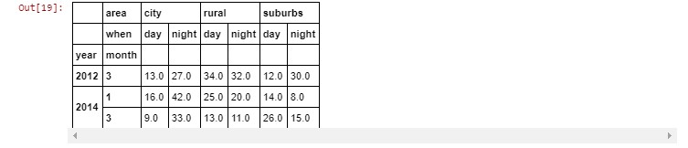

# Lab : Hierarchical Indexing

#### Pre-reqs:
- Google Chrome (Recommended)

#### Lab Environment
Notebooks are ready to run. All packages have been installed. There is no requirement for any setup.

**Note:** Elev8ed Notebooks (powered by Jupyter) will be accessible at the port given to you by your instructor. Password for jupyterLab : `1234`

All Notebooks are present in `work/PythonForSASUsers` folder. To copy and paste: use **Control-C** and to paste inside of a terminal, use **Control-V**

You can access jupyter lab at `<host-ip>:<port>/lab/workspaces/lab7_Indexing`

##### Run Notebook
Click notebook `Chapter 06 -- Hierarchical Indexing.ipynb` in jupterLab UI and run jupyter notebook.

## Topics Covered

MultiIndexing

Multi-Indexed Selection

xs() method for cross sections

Advanced Indexing with .loc indexer

Using Boolean operators with .loc indexer

stack() and unstack() methods

Resources

```
In [1]:
import pandas as pd
import numpy as np
from pandas import Series, DataFrame, Index
from IPython.display import Image
Simply put, a MultiIndex (also referred to as a hierarchical index) allows multiple index levels within a single index. Higher dimensional data can be represented in a one-dimensional Series or a two-dimensional DataFrame. Start with the creation of a synthetic DataFrame whose values are used to represent the number of traffic violations issued in cell #3 below.

pandas provide constructor methods allowing components to be defined separately. The construction of the index and columns below is self-explanatory.

For the data component: The first data = assignment constructs an array using numpy's random number generator with the round() method used to return the integer portion. The second date = assignment multiples the array of integers by 100 and floor divides by 5, and finally taking the absolute value.

The tickets = assignment constructs the DataFrame from the constituents.

## MultiIndexing

```
In [2]:
index = pd.MultiIndex.from_product([[2012, 2013, 2014, 2015], ['1', '2', '3']],
                                   names=['year', 'month'])
columns=pd.MultiIndex.from_product([['city', 'suburbs', 'rural'], ['day', 'night']],
                                    names=['area', 'when'])

data = np.round(np.random.randn(12, 6),2)
data = abs(np.floor_divide(data[:] * 100, 5))

tickets = pd.DataFrame(data, index=index, columns=columns).sort_index().sort_index(axis=1)
```
In [3]:
index
```

Out[3]:
MultiIndex(levels=[[2012, 2013, 2014, 2015], ['1', '2', '3']],
           labels=[[0, 0, 0, 1, 1, 1, 2, 2, 2, 3, 3, 3], [0, 1, 2, 0, 1, 2, 0, 1, 2, 0, 1, 2]],
           names=['year', 'month'])
Notice how the MultiIndex displayed above contains multiple levels of indexing, in this case 'year' and 'month' along the row dimension. The levels act as labels for each data value encoding these names.

In SAS, the terminology is 'month' nested within 'year'. Said another way, 'month' is the inner-most level of the index.

```
In [4]:
tickets.columns
```

Out[4]:
MultiIndex(levels=[['city', 'rural', 'suburbs'], ['day', 'night']],
           labels=[[0, 0, 1, 1, 2, 2], [0, 1, 0, 1, 0, 1]],
           names=['area', 'when'])
Similiarly, the indexing for columns contains multiple levels, with the name 'area' labeling the outer levels 'city', 'rural', and 'suburbs'. 'when' is the name for the inner levels 'day' and 'night'.

```
In [5]:
tickets

```


```
In [6]:
tickets.shape
```

Out[6]:
(12, 6)
Another SAS-like way to think of a MultiIndex is nested group-by's illustrated in cell below with PROC SORT. The resulting SAS data set tickets is 'tall' and 'skinny' with one observation for each of the nested levels.

Below, we will illustrate how 'stacking' the DataFrame can be used to reshape it to a form similiar to the SAS data set tickets.

    /******************************************************/
    /* c06_tickets_proc_sort.sas                          */
    /******************************************************/
    34       proc sort;
    35       by year month area nd;
    NOTE: 72 observations were read from "WORK.tickets"
    NOTE: Data set "WORK.tickets" has 72 observation(s) and 5 variable(s)
A SAS analog of the tickets Dataframe is rendered using PROC TABULATE. Unlike the DataFrame methods illustrated here, the physical shape of the SAS data set is not changed. In this case PROC TABULATE processes the 'tall' SAS data set to produce printed output shaped like the 'tickets' DataFrame.

    /******************************************************/
    /* c06_tickets_proc_tabulate.sas                      */
    /******************************************************/
    12       data tickets;
    13       length area $ 7;
    14       call streaminit(time());
    15       do year = 2012 to 2015;
    16          do month = 1 to 3;
    17             do area = 'City', 'Suburbs', 'Rural';
    18                do nd = 'Night', 'Day';
    19                   tickets = abs(int(rand( 'NORMAL')*100));
    20                   output;
    21                end;
    22             end;
    23          end;
    24       end;
    25       proc tabulate;
    26          var tickets;;
    27          class area nd year month;
    28             table year * month ,
    29                   area=' ' * nd=' ' * sum=' ' * tickets=' ';
```
In [7]:
Image(filename='output/tabulate.JPG')

```


## Multi-Indexed Selection

The tickets DataFrame is essentially four-dimensional with area nested within when for columns, and month nested within year for rows. The multi-indexing for both rows and columns make sub-setting operations straightforward. In this case, selecting by the index label 'rural' returns an entire DataFrame. Strictly speaking, 'rural' is a level in the column MultiIndex illustrated in cell #5 above.

Select all rows by the 'rural' level.

```
In [8]:
tickets['rural']

```


Select all rows for tickets issued in the city at night.

```
In [9]:
tickets['city', 'night']
```

Out[9]:
year  month
2012  1        18.0
      2        25.0
      3        27.0
2013  1         7.0
      2        10.0
      3        17.0
2014  1        42.0
      2         9.0
      3        33.0
2015  1        21.0
      2         2.0
      3         2.0
Name: (city, night), dtype: float64
Multiple keys can be specified. Above, the request is for those tickets issued at 'night' in the 'city'. In this instance a Series is returned.

The examples in cells #8 and #9 work by selecting labels from 'area' which is the outer-most MultiIndex level for columns in the tickets DataFrame. Said another way, 'when' ('day' or 'night') is nested inside 'area'.

Another method to select rows and columns nested inside a hierarchical index is the DataFrame xs() method. This cross-section method generally results in a smaller DataFrame than the original.

## xs() method for cross sections

The DataFrame xs() method uses the level argument to select data for rows and columns. The example in the cell below selects the 1st month for each year.

```
In [10]:
tickets.xs(('1'), level='month')

```


Likewise, you can request just the rows for 2013.

```
In [11]:
tickets.xs((2013), level='year')

```


Selections can use multiple keys. In this case, 2013 and month '1'.

```
In [12]:
tickets.xs((2013, '1'), level=('year', 'month'))

```


The .xs method also works for columns with the optional axis=1 (for columns) argument. In this case, the column 'night' in each of the 3 areas is selected.

```
In [13]:
tickets.xs(('night'), level='when', axis=1)

```


## Advanced Indexing with .loc indexer
Chapter 5, Understanding Indexes covers the .loc indexer which can also be used with hierarchical indicies.

The colon (:) to the left of the comma (,) selects all rows. The selection to the right of the comma (,) requests the levels 'city' and 'suburbs' from 'area'.

```
In [14]:
tickets.loc[:,['city', 'suburbs']]

```


Below is a an example of partial slicing.

```
In [15]:
tickets.loc[2013:2014, ['city', 'suburbs']]

```


The example below illustrates slicing with a range of values by providing tuples containing both the row slice ( 2nd month, 2013 to 3rd month 2014) and the column slice ('rural' 'day' to 'suburbs' 'day').

```
In [16]:
tickets.loc[(2013, '2') : (2014, '3'), ('rural', 'day') : ('suburbs', 'day')]

```


The example below illustrates the .loc() indexer using multiple keys for row and column slices.

```
In [17]:
tickets.loc[(2013, '3'): (2014, '1')]

```


```
In [18]:
tickets.loc[(2013, '3'): (2014, '1'), "city"]

```


## Using Boolean operators with .loc indexer

Using boolean operators with the .loc indexer permits boolean evaluations across the Dataframe values. You can use a pd.IndexSlice to permit syntax using the colon (:) rather then slice(None) syntax when specifying ranges.

The mask object returns the boolean value True which is applied to the column MultiIndex 'night' as the inner-most index level within 'city'. Notice the shape of the DataFrame is defined by just those rows in the 'night' within 'city' column construct that evaluate True.

```
In [19]:
idx = pd.IndexSlice
mask = tickets[('city','night')]>25
tickets.loc[idx[mask,:,]]

```



The example in the cell below applies the boolean 'mask2' to all values in the DataFrame

```
In [20]:
mask2 = tickets[('rural', 'day')]>15
tickets.loc[idx[mask2, 'city':'rurual']]

```


The example below applies boolean 'mask2' and also scopes the column request.

```
In [21]:
tickets.loc[idx[mask2, 'rural']]

```


## stack() and unstack() methods

DataFrames with hierarchical indices can use the .stack and .unstack attributes to reshape data from 'tall and skinny' to 'short and fat' formats and vice-versa.

The .stack() attribute pivots columns into rows. The .unstack() attribute pivots rows into columns. Consider the examples in the cell below.

The .unstack() attribute used without any arguments in this case pivots the 'month' rows to the inner-most index level of the columns. 'month' was the inner-most index level for rows. Also notice how we assigned the 'unstacked' DataFrame to create the new one, df_u.

```
In [22]:
df_u = tickets.unstack()
df_u

```


```
In [23]:
df_u.columns
```

Out[23]:
MultiIndex(levels=[['city', 'rural', 'suburbs'], ['day', 'night'], ['1', '2', '3']],
           labels=[[0, 0, 0, 0, 0, 0, 1, 1, 1, 1, 1, 1, 2, 2, 2, 2, 2, 2], [0, 0, 0, 1, 1, 1, 0, 0, 0, 1, 1, 1, 0, 0, 0, 1, 1, 1], [0, 1, 2, 0, 1, 2, 0, 1, 2, 0, 1, 2, 0, 1, 2, 0, 1, 2]],
           names=['area', 'when', 'month'])
The .stack() attribute performs the reverse operation of the .unstack() attribute. The .stack() attribute takes the inner most index level of the columns level and pivots them to the inner-most index level of the rows. In this case the new DataFrame is called df_s.

```
In [24]:
df_s = tickets.stack()
df_s

```


DataFrames containing MultiIndexes can 'stack' and 'unstack' multiple levels at a time.

```
In [25]:
df_like_sas = pd.DataFrame(tickets.stack(level=['when', 'area']))
We can 'stack' the original tickets DataFrame by the levels 'when' and 'area' from the column MultiIndex to create a new DataFrame shaped similiarly to the SAS data set tickets.

```
In [26]:
df_like_sas.shape
```

Out[26]:
(72, 1)
Display the first 12 rows.

```
In [27]:
df_like_sas.head(12)

```


## Resources

Python Data Science Handbook , Essential Tools for Working With Data, by Jake VanderPlas.

Reshaping by pivoting DataFrame objects , from the pandas 0.19.0 documentation.

Reshaping by stacking and unstacking from the pandas 0.19.0 documentation.

MultiIndex / Advanced Indexing from the pandas 0.19.0 documentation.

